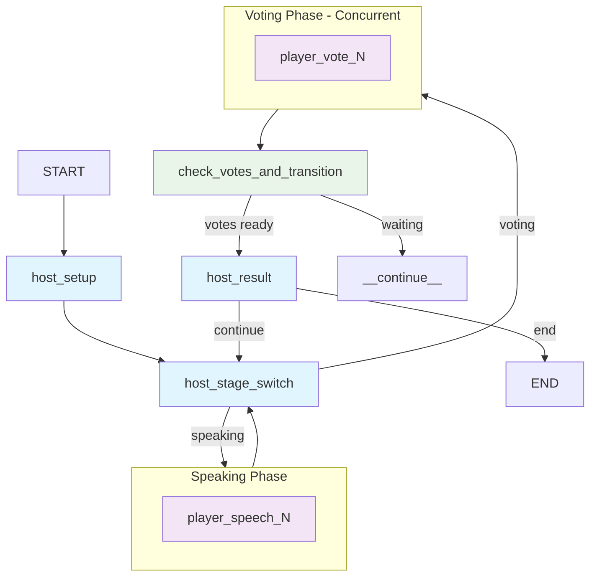

# LieGraph – An AI-Powered "Who Is Spy" Game

LieGraph is a multi-agent implementation of the popular social deduction game "Who Is spy," built with LangGraph. It features AI agents that can reason, strategize, and interact in natural language to find the spy among them.


## ✨ Features

- **Autonomous AI Agents:** AI players with unique personalities and strategic thinking.
- **Identity Inference:** Agents dynamically infer their own and others' identities based on conversation history and voting patterns.
- **Natural Language Interaction:** Agents communicate and reason in natural language.
- **Dynamic Game Flow:** A sophisticated state machine built with LangGraph manages the game logic.
- **Real-time Web UI:** A React-based frontend to visualize the game in real-time.
- **Configurable Gameplay:** Easily customize the number of players, vocabulary, and more.
- **i18n Support:** The UI supports both English and Chinese.

## 🚀 Quick Start

### Prerequisites

- Python 3.12+
- Node.js 16+
- `uv` (recommended for Python package management)

### Environment Variables

This project uses environment variables to configure the Large Language Models (LLMs) used by the AI agents. You need to create a `.env` file in the root directory of the project and populate it with your API keys and preferred LLM settings.

1.  **Create a `.env` file:**
    ```bash
    touch .env
    ```

2.  **Add your LLM configuration to `.env`:**
    Choose your preferred LLM provider and add the corresponding variables.

    **Example for OpenAI:**
    ```
    LLM_PROVIDER=openai
    OPENAI_API_KEY="your_openai_api_key_here"
    OPENAI_MODEL="gpt-4o-mini" # Or your preferred OpenAI model
    ```
    
    **Example for DeepSeek:**
    ```
    LLM_PROVIDER=deepseek
    DEEPSEEK_API_KEY="your_deepseek_api_key_here"
    DEEPSEEK_MODEL="deepseek-chat" # Or your preferred DeepSeek model
    ```

    **Note:** Replace `"your_api_key_here"` with your actual API key. It's recommended to use a model that supports a good context window for optimal agent performance.

### Installation & Running

1.  **Clone the repository:**
    ```bash
    git clone https://github.com/leslieo2/LieGraph.git
    cd LieGraph
    ```

2.  **Install Python dependencies:**
    ```bash
    # Install uv if you don't have it
    curl -LsSf https://astral.sh/uv/install.sh | sh
    # Install dependencies
    uv sync
    ```

3.  **Install UI dependencies:**
    ```bash
    cd ui-web/frontend
    npm install
    ```

4.  **Start the backend:**
    ```bash
    langgraph dev --config langgraph.json --port 8124 --allow-blocking
    ```

5.  **Start the UI:**
    ```bash
    # From the ui-web/frontend directory
    npm start
    ```
    Open your browser to `http://localhost:3000` to play the game.

## 🎮 How It Works

The game is orchestrated by a `StateGraph` from the LangGraph library, which manages the game's state and flow.

### Game Flow

1.  **Setup:** The host agent assigns roles (Civilian or Spy) and corresponding words to the players.
2.  **Speaking:** Each player takes a turn to describe their word. The AI agents use LLM-based reasoning to craft their descriptions while analyzing others' speech for identity clues.
3.  **Identity Inference:** Throughout the game, agents continuously analyze conversation patterns to infer their own and others' identities based on speech consistency and strategic behavior.
4.  **Voting:** All players vote simultaneously for who they think the spy is, using their accumulated identity inferences.
5.  **Result:** The player with the most votes is eliminated.
6.  **Win Condition:** The game ends when the spy is voted out (Civilians win) or when the spies equal or outnumber the civilians (Spies win).

### AI Agent Architecture

Each AI player maintains a sophisticated "mindset" that evolves throughout the game:

- **Dynamic Identity Inference:** Agents continuously analyze conversation history to infer their own and others' identities:
  - **Self-Identity Analysis:** Agents examine their own word descriptions and voting patterns to deduce their role
  - **Other-Player Analysis:** Agents track other players' speech patterns, voting behavior, and strategic moves
  - **Conversation History Processing:** Real-time analysis of all game dialogue to identify inconsistencies and clues

- **Probabilistic Belief System:**
  - **Self-Belief:** Confidence in their own role based on accumulated evidence
  - **Suspicions Matrix:** Probabilistic beliefs about the roles of all other players
  - **Evidence Tracking:** Systematic recording of suspicious behaviors and contradictions

- **Strategic Reasoning:** The chain of thought behind decisions, incorporating:
  - Bluff detection and counter-bluff strategies
  - Alliance formation and betrayal prevention
  - Long-term planning based on evolving identity beliefs

This sophisticated architecture enables agents to engage in complex strategic gameplay, adapting their strategies as they gather more information from the conversation flow.



## ⚙️ Configuration

You can customize the game by editing `config.yaml`:

```yaml
game:
  player_count: 6
  vocabulary:
    - ["Shakespeare", "Dumas"]
    - ["太阳", "月亮"]
  player_names:
    - "Alice"
    - "Bob"
    # ...
```

## 🛠️ Development

### Project Structure
```
LieGraph/
├── src/
│   ├── game/
│   │   ├── graph.py          # Main LangGraph workflow
│   │   ├── state.py          # Game state definitions
│   │   ├── nodes/            # Graph node implementations
│   │   ├── rules.py          # Game logic and win conditions
│   │   └── llm_strategy.py   # AI reasoning and speech generation
├── tests/                    # Pytest test suite
├── ui-web/frontend/          # React web interface
└── config.yaml               # Game configuration
```

### Running Tests
```bash
python -m pytest tests/ -v
```

## 🗺️ Roadmap

- [ ] Enhanced AI strategy and long-term memory.
- [ ] Game replay and analysis features.
- [ ] Support for more complex game modes.

## 🤝 Contributing

Contributions are welcome! Please feel free to open an issue or submit a pull request.

1.  Fork the repository.
2.  Create a new feature branch.
3.  Make your changes and add tests.
4.  Submit a pull request.

## 📄 License

This project is licensed under the MIT License.
