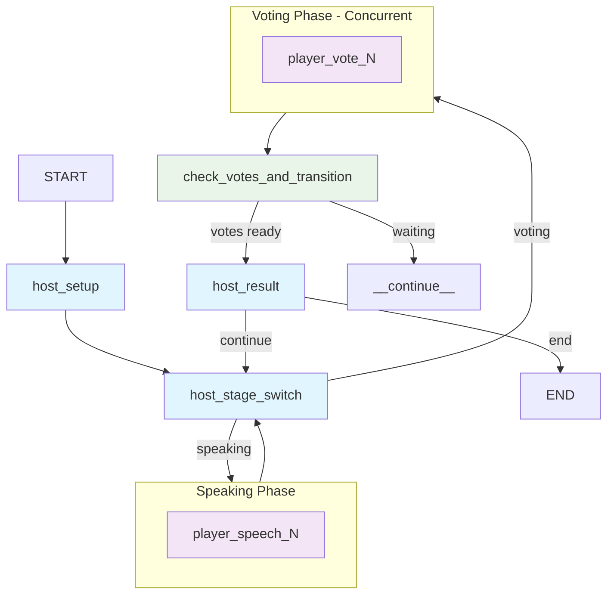

# LieGraph – An AI Agent-Driven "Who Is Spy" Game
[English Version](README.md) | [中文版本](README_zh.md)

   

LieGraph is a multi-agent implementation of the popular social deduction game "Who Is spy," built with LangGraph. It features AI agents that can reason, strategize, and interact in natural language to find the spy among them.


## ✨ Features

- **Autonomous AI Agents:** AI players with unique personalities and strategic thinking capabilities
- **Dynamic Identity Inference:** Agents continuously analyze conversation history and voting patterns to infer their own and others' identities
- **Natural Language Interaction:** Agents communicate and reason in natural language throughout the game
- **Probabilistic Belief System:** Sophisticated belief tracking with self-belief confidence and suspicions matrix
- **Strategic Reasoning:** Advanced bluff detection, alliance formation, and long-term planning
- **LLM-driven Strategy:** Structured tools for speech planning and voting decisions
- **Built-in Metrics:** Automatic quality tracking for win balance, identification accuracy, and speech diversity with JSON reports for prompt evaluation workflows
- **Historical Analysis:** CLI tools for aggregating and analyzing game metrics summaries

## 🚀 Quick Start

### Prerequisites

- Python 3.12+
- Node.js 16+
- `uv` (recommended for Python package management)

### Environment Variables

Create a `.env` file in the root directory with your LLM configuration:

```bash
touch .env
```

**Example for OpenAI:**
```
LLM_PROVIDER=openai
OPENAI_API_KEY="your_openai_api_key_here"
OPENAI_MODEL="gpt-4o-mini"
```

**Example for DeepSeek:**
```
LLM_PROVIDER=deepseek
DEEPSEEK_API_KEY="your_deepseek_api_key_here"
DEEPSEEK_MODEL="deepseek-chat"
```

### Installation & Running

1. **Clone and setup:**
    ```bash
    git clone https://github.com/leslieo2/LieGraph.git
    cd LieGraph
    ```

2. **Install dependencies:**
    ```bash
    # Install uv if needed
    curl -LsSf https://astral.sh/uv/install.sh | sh
    uv sync

    # Install UI dependencies
    cd ui-web/frontend
    npm install
    ```

3. **Start services:**
    ```bash
    # Backend (from project root)
    langgraph dev --config langgraph.json --port 8124 --allow-blocking

    # Frontend (from ui-web/frontend)
    npm start
    ```

Open `http://localhost:3000` to play the game.

## 🎮 How It Works

### Game Flow

The game is orchestrated by a `StateGraph` from LangGraph that manages the complete game lifecycle:

1. **Setup:** Host agent assigns roles (Civilian/Spy) and corresponding words
2. **Speaking Phase:** Players take turns describing their words using LLM-based reasoning
3. **Identity Inference:** Agents analyze conversation patterns to deduce roles
4. **Voting Phase:** All players vote simultaneously based on accumulated evidence
5. **Result:** Player with most votes is eliminated
6. **Win Condition:** Game ends when spy is voted out (Civilians win) or spies outnumber civilians (Spies win)

### AI Agent Architecture

Each AI player maintains an evolving "mindset" with sophisticated reasoning capabilities:

- **Dynamic Identity Inference:**
  - Self-identity analysis through word descriptions and voting patterns
  - Other-player analysis tracking speech patterns and strategic behavior
  - Real-time conversation history processing for inconsistency detection

- **Probabilistic Belief System:**
  - Self-belief confidence based on accumulated evidence
  - Suspicion matrix tracking probabilistic beliefs about other players
  - Systematic evidence recording of suspicious behaviors

- **Strategic Reasoning:**
  - Bluff detection and counter-bluff strategies
  - Alliance formation and betrayal prevention
  - Long-term planning based on evolving identity beliefs



## ⚙️ Configuration

Customize the game by editing `config.yaml`:

```yaml
game:
  player_count: 6
  vocabulary:
    - ["Shakespeare", "Dumas"]
    - ["太阳", "月亮"]
  player_names:
    - "Alice"
    - "Bob"
    # ...
```

## 📊 Metrics & Evaluation

LieGraph ships with a lightweight metrics collector (`src/game/metrics.py`) that records quality indicators as games unfold:

- **Win balance:** Civilian vs. spy win rates and a fairness score targeting 50/50 outcomes.
- **Identification accuracy:** Tracks how confidently players identify their own roles and others over time.
- **Speech diversity:** Measures lexical variety per speech turn to surface repetitive phrasing.

Metrics are streamed to memory during play and automatically persisted when a game ends:

- Per-game summaries: `logs/metrics/{game_id}.json`
- Rolling aggregate + functional quality score: `logs/metrics/overall.json`

You can also access the live collector from code:

```python
from src.game.metrics import metrics_collector

audit = metrics_collector.get_overall_metrics()
score = metrics_collector.compute_quality_score()  # deterministic
# metrics_collector.compute_quality_score(method="llm", llm=client) for LLM-based review
```

These outputs are ready to feed into downstream prompt-evaluation or offline analysis pipelines.

### Metrics Progress

- Maintain a running ledger in [`docs/metrics-history.md`](docs/metrics-history.md) so prompt and strategy changes can be tracked against key metrics.
- After each batch, record the latest `logs/metrics/overall.json` summary there and archive the raw JSON if you need long-term snapshots.

## 🛠️ Development

### Project Structure
```
LieGraph/
├── src/
│   ├── game/
│   │   ├── graph.py          # Main LangGraph workflow
│   │   ├── state.py          # Game state definitions
│   │   ├── nodes/            # Graph node implementations
│   │   ├── rules.py          # Game logic and win conditions
│   │   ├── strategy/         # AI strategy coordination and builders
│   │   ├── agent_tools/      # Structured tools for speech and voting
│   │   └── metrics.py        # Game metrics and quality scoring
├── tests/                    # Pytest test suite
├── ui-web/frontend/          # React web interface
└── config.yaml               # Game configuration
```

### System Architecture

For detailed architecture information, component design, and integration patterns, see [ARCHITECTURE.md](ARCHITECTURE.md).

### Running Tests
```bash
python -m pytest tests/ -v
```

## 🗺️ Roadmap

- [ ] Enhanced AI strategy and long-term memory
- [ ] Game replay and analysis features
- [ ] Support for more complex game modes
- [ ] LLM benchmark capabilities for evaluating different models

## 🤝 Contributing

Contributions are welcome! Please:

1. Fork the repository
2. Create a feature branch
3. Make changes and add tests
4. Submit a pull request

## 📄 License

This project is licensed under the MIT License - see the [LICENSE](LICENSE) file for details.
