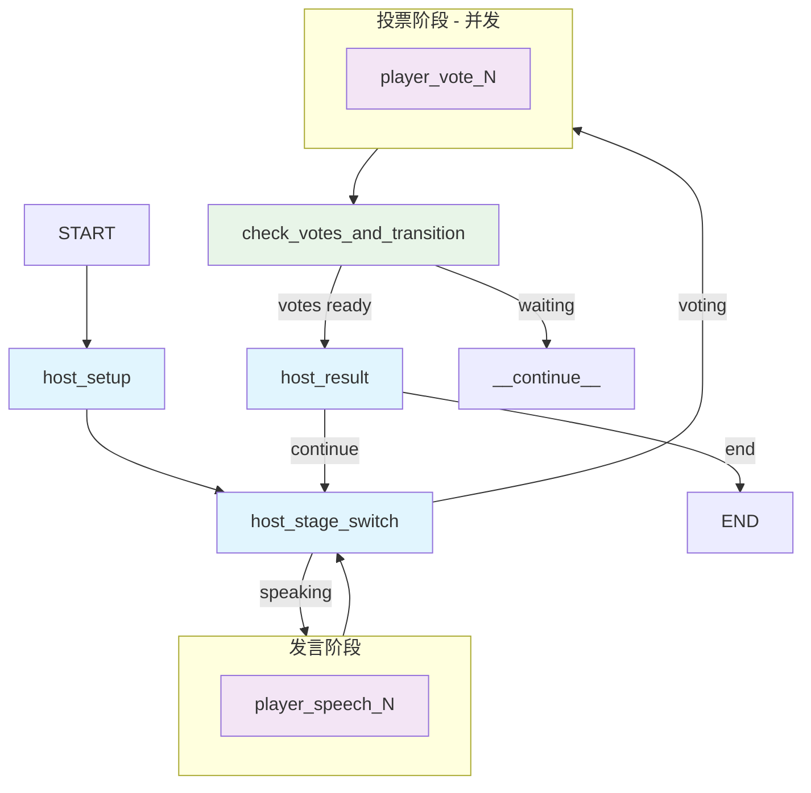

# LieGraph – AI 智能体驱动的 "谁是卧底" 游戏

[English Version](README.md) | [中文版本](README_zh.md)

   

LieGraph 是基于 LangGraph 构建的流行社交推理游戏 "谁是卧底" 的多智能体实现。它具备能够推理、制定策略并以自然语言互动的 AI 智能体，用于在玩家中找出卧底。


## ✨ 功能特性

- **自主 AI 智能体:** 具有独特个性和战略思维能力的 AI 玩家
- **动态身份推理:** 智能体持续分析对话历史和投票模式来推断自己和他人的身份
- **自然语言交互:** 智能体在整个游戏中以自然语言进行交流和推理
- **概率信念系统:** 具有自我信念置信度和怀疑矩阵的复杂信念追踪系统
- **战略推理:** 高级的虚张声势检测、联盟形成和长期规划
- **内建指标:** 自动追踪胜率平衡、身份识别准确率与发言多样性，并生成 JSON 报告以供后续提示词评估使用

## 🚀 快速开始

### 环境要求

- Python 3.12+
- Node.js 16+
- `uv` (推荐用于 Python 包管理)

### 环境变量

在根目录创建 `.env` 文件并配置您的 LLM:

```bash
touch .env
```

## 📊 指标与评估

项目内置一个轻量的指标收集器（`src/game/metrics.py`），在游戏过程中实时记录以下指标：

- **胜率平衡：** 跟踪平民与卧底胜率以及目标为 50/50 的公平度得分。
- **身份识别准确率：** 监测玩家对自身及他人身份判断的准确趋势。
- **发言多样性：** 按回合统计词汇多样性，帮助发现重复或单调的发言。

当游戏结束时，指标会自动写入：

- 单局摘要：`logs/metrics/{game_id}.json`
- 全局聚合与函数版总分：`logs/metrics/overall.json`

如需在代码中获取实时数据，可直接调用：

```python
from src.game.metrics import metrics_collector

report = metrics_collector.get_overall_metrics()
score = metrics_collector.compute_quality_score()  # 函数评分
# metrics_collector.compute_quality_score(method="llm", llm=client) 可获取 LLM 评价
```

这些成果可以直接用于后续的提示词评估或离线分析流程。

**OpenAI 配置示例:**
```
LLM_PROVIDER=openai
OPENAI_API_KEY="your_openai_api_key_here"
OPENAI_MODEL="gpt-4o-mini"
```

**DeepSeek 配置示例:**
```
LLM_PROVIDER=deepseek
DEEPSEEK_API_KEY="your_deepseek_api_key_here"
DEEPSEEK_MODEL="deepseek-chat"
```

### 安装与运行

1. **克隆并设置:**
    ```bash
    git clone https://github.com/leslieo2/LieGraph.git
    cd LieGraph
    ```

2. **安装依赖:**
    ```bash
    # 如需安装 uv
    curl -LsSf https://astral.sh/uv/install.sh | sh
    uv sync

    # 安装 UI 依赖
    cd ui-web/frontend
    npm install
    ```

3. **启动服务:**
    ```bash
    # 后端 (从项目根目录)
    langgraph dev --config langgraph.json --port 8124 --allow-blocking

    # 前端 (从 ui-web/frontend 目录)
    npm start
    ```

打开 `http://localhost:3000` 开始游戏。

## 🎮 工作原理

### 游戏流程

游戏由 LangGraph 的 `StateGraph` 编排，管理完整的游戏生命周期：

1. **设置:** 主持智能体分配角色（平民/卧底）和对应词语
2. **发言阶段:** 玩家轮流使用基于 LLM 的推理描述他们的词语
3. **身份推理:** 智能体分析对话模式来推断角色
4. **投票阶段:** 所有玩家基于累积证据同时投票
5. **结果:** 得票最多的玩家被淘汰
6. **胜利条件:** 卧底被投出时游戏结束（平民胜利）或卧底人数超过平民时（卧底胜利）

### AI 智能体架构

每个 AI 玩家维护一个不断发展的 "思维模式"，具备复杂的推理能力：

- **动态身份推理:**
  - 通过词语描述和投票模式进行自我身份分析
  - 其他玩家分析，追踪发言模式和策略行为
  - 实时对话历史处理以检测不一致性

- **概率信念系统:**
  - 基于累积证据的自我信念置信度
  - 追踪对其他玩家概率信念的怀疑矩阵
  - 系统记录可疑行为的证据

- **战略推理:**
  - 虚张声势检测和反虚张声势策略
  - 联盟形成和背叛预防
  - 基于不断发展的身份信念进行长期规划



## ⚙️ 配置

通过编辑 `config.yaml` 自定义游戏：

```yaml
game:
  player_count: 6
  vocabulary:
    - ["Shakespeare", "Dumas"]
    - ["太阳", "月亮"]
  player_names:
    - "Alice"
    - "Bob"
    # ...
```

## 🛠️ 开发

### 项目结构
```
LieGraph/
├── src/
│   ├── game/
│   │   ├── graph.py          # 主 LangGraph 工作流
│   │   ├── state.py          # 游戏状态定义
│   │   ├── nodes/            # 图节点实现
│   │   ├── rules.py          # 游戏逻辑和胜利条件
│   │   └── llm_strategy.py   # AI 推理和发言生成
├── tests/                    # Pytest 测试套件
├── ui-web/frontend/          # React 网页界面
└── config.yaml               # 游戏配置
```

### 系统架构

有关详细的架构信息、组件设计和集成模式，请参阅 [ARCHITECTURE.md](ARCHITECTURE.md)。

### 运行测试
```bash
python -m pytest tests/ -v
```

## 🗺️ 路线图

- [ ] 增强 AI 策略和长期记忆
- [ ] 游戏回放和分析功能
- [ ] 支持更复杂的游戏模式
- [ ] LLM 基准测试能力，用于评估不同模型

## 🤝 贡献

欢迎贡献！请：

1. Fork 仓库
2. 创建功能分支
3. 进行更改并添加测试
4. 提交 pull request

## 📄 许可证

本项目采用 MIT 许可证 - 详见 [LICENSE](LICENSE) 文件。
